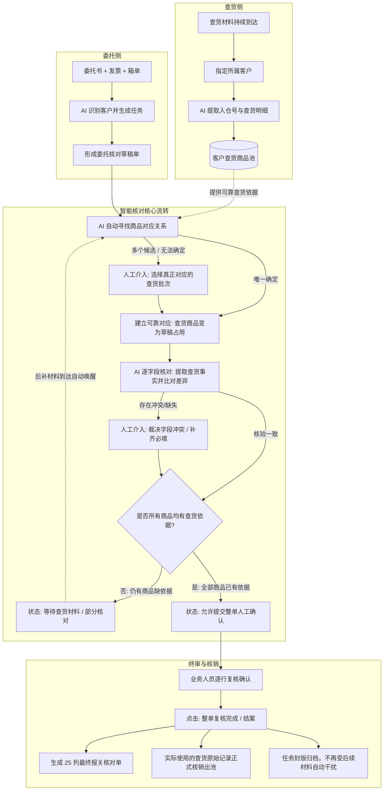
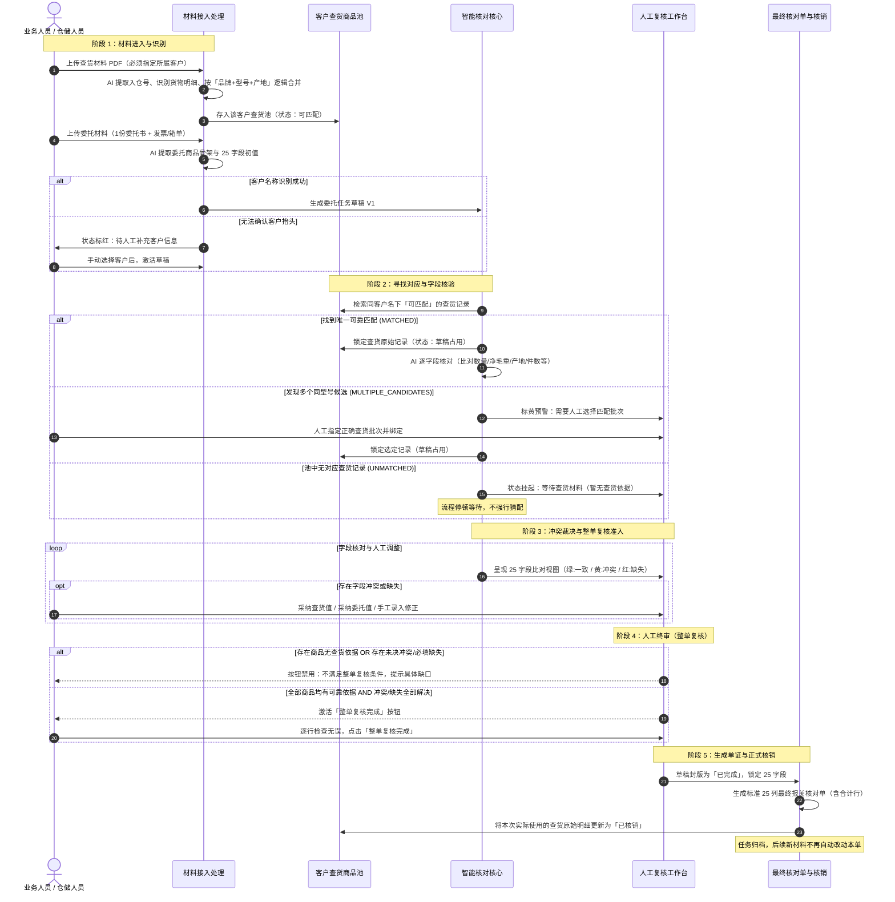

# 九立报关单证智能核对工作台｜产品逻辑与用户使用指南

> **适用对象**：九立报关业务人员、单证操作员、产品经理、实施顾问及业务主管  
> **版本**：v1.1 Final  
> **编制依据**：项目最终需求文档、提示词方案 v3.0、实现规范及高拟真工作台系统实际实现  

---

## 目录

- [一、5分钟快速上手（新手必读）](#一5分钟快速上手新手必读)
- [二、产品是什么：我们要解决什么问题](#二产品是什么我们要解决什么问题)
- [三、核心心智模型：业务底层逻辑](#三核心心智模型业务底层逻辑)
- [四、第一次使用前必须理解的业务对象](#四第一次使用前必须理解的业务对象)
- [五、一张图讲清完整业务流转旅程](#五一张图讲清完整业务流转旅程)
- [六、业务人员的一天：日常工作流程与操作路径](#六业务人员的一天日常工作流程与操作路径)
- [七、逐页面产品逻辑与交互详解](#七逐页面产品逻辑与交互详解)
  - [1. 客户工作台（全局看板模式）](#1-客户工作台全局看板模式)
  - [2. 客户工作台（客户详情与商品对应模式）](#2-客户工作台客户详情与商品对应模式)
  - [3. 当前核对任务（核对工作台）](#3-当前核对任务核对工作台)
  - [4. 查货商品池](#4-查货商品池)
  - [5. 新建核对任务与材料上传](#5-新建核对任务与材料上传)
  - [6. 历史任务与操作追溯](#6-历史任务与操作追溯)
  - [7. Demo 控制台（演示专用工具）](#7-demo-控制台演示专用工具)
- [八、完整业务状态体系与流转指南](#八完整业务状态体系与流转指南)
  - [1. 委托任务状态](#1-委托任务状态)
  - [2. 委托商品行状态](#2-委托商品行状态)
  - [3. 查货商品状态](#3-查货商品状态)
  - [4. 颜色与视觉语义定义](#4-颜色与视觉语义定义)
- [九、AI 与人工的职责边界：AI做哪些，什么必须由你决定](#九ai-与人工的职责边界ai做哪些什么必须由你决定)
- [十、典型业务场景图解教学](#十典型业务场景图解教学)
  - [场景一：委托与查货完全匹配，AI 自动完成核对](#场景一委托与查货完全匹配ai-自动完成核对)
  - [场景二：委托材料先到，暂时没有查货数据](#场景二委托材料先到暂时没有查货数据)
  - [场景三：后补查货材料，AI 自动触发增量核对](#场景三后补查货材料ai-自动触发增量核对)
  - [场景四：一个商品存在多个查货批次候选，人工确认对应](#场景四一个商品存在多个查货批次候选人工确认对应)
  - [场景五：委托书客户抬头缺失，人工指定客户](#场景五委托书客户抬头缺失人工指定客户)
  - [场景六：商品对应已确定，但委托与查货存在字段冲突](#场景六商品对应已确定但委托与查货存在字段冲突)
  - [场景七：AI 全部核对完成，人工最终复核与封版核销](#场景七ai-全部核对完成人工最终复核与封版核销)
- [十一、核心业务功能全览（用户目的导向）](#十一核心业务功能全览用户目的导向)
- [十二、业务常见问题解答（FAQ）](#十二业务常见问题解答faq)
- [十三、附录：待确认产品口径与技术概念对照](#十三附录待确认产品口径与技术概念对照)

---

## 一、5分钟快速上手（新手必读）

如果你是第一次打开这套工作台，不需要通读几十页手册，请按照以下 **8 步极简流程** 开始第一天的工作：

```text
步骤 1：打开「客户工作台」
       ↓
步骤 2：在顶部状态筛选中点击「需要我处理」
       （系统已自动筛选出存在人工阻断、多候选或待复核的客户）
       ↓
步骤 3：点击需要处理的客户卡片，查看其委托任务清单
       ↓
步骤 4：点击任务进入「当前核对任务」（核对工作台）
       ↓
步骤 5：查看顶部提示：AI 停在哪一步？
       • 提示“客户信息缺失” → 人工选择所属客户
       • 提示“存在多个查货候选” → 点击右侧「查货核验依据」，确认匹配批次
       • 提示“存在字段冲突” → 点击标黄单元格，查看委托与查货差异，点击采纳或手动修改
       ↓
步骤 6：当任务提示“全部商品已有可靠查货依据”时，点击底部「提交整单人工确认」
       （此时进入人工复核阶段，逐行检查 AI 核对结果）
       ↓
步骤 7：逐行核对无误后，点击行末「确认该行」，使所有商品状态转为“人工已确认”
       ↓
步骤 8：确认无误后，点击右上角「整单复核完成」
       （系统生成 25 列最终报关核对单，使用的查货商品正式核销出池，任务封版归档）
```

> [!TIP]
> **记住一句话口诀**：  
> **红灯补必填，黄灯裁冲突，蓝灯选批次，绿灯查一致；全部有依据，人工把关签；点击结案单，查货才核销。**

---

## 二、产品是什么：我们要解决什么问题

### 1. 业务痛点与解决的问题
在传统进出口报关单证制作过程中，报关员每天需要面对海量、格式不一且分批到达的材料：
- **委托方提供的材料**：报关委托书、发票（Invoice）、装箱单（Packing List），可能存在多张发票箱单、品名规格各异的情况；
- **仓库现场提供的材料**：查货记录单（PDF扫描件或图片），记录了实际到仓货物的品牌、型号、实测产地、件数、实测净重和毛重，一个查货文档里常常混杂着多个入仓号。

过去，报关员主要把时间耗费在**机械枯燥的搬砖与跨文件肉眼比对**上：
1. 拿着委托书，翻找对应的查货单（常常由于型号包含前后缀、空格、大小写差异难以快速匹配）；
2. 逐行比对 20 多项申报字段；
3. 一旦发票与委托书数量对不上，或者查货记录与委托书产地有出入，就要来回翻看好几个文件核实；
4. 遇到查货材料还没到的情况，任务只能搁置，过两天材料到了又要重新从头翻看；
5. 制作完报关单草单后，还需要手工在 Excel 或台账里标记“这批货已经报过关了”，极易发生漏核销、重复使用库存或错核的问题。

### 2. 使用系统后的全新分工
九立智能核对工作台将人机分工进行了彻底重构：

| 工作环节 | 过去：传统纯人工模式 | 现在：AI 智能核对工作台 |
| :--- | :--- | :--- |
| **材料归集** | 人工接收邮件、下载附件、手动分拣归类 | 系统按客户维护独立材料池与查货商品池，材料随时进入随时归集 |
| **商品匹配** | 报关员凭肉眼逐行比对委托型号与查货型号 | **AI 自动匹配**：自动跨文件寻找同品牌、同型号、同产地的可靠依据 |
| **字段核验** | 报关员逐字比对 25 个申报字段，人工查验数值与单价 | **AI 逐字段核查**：一致的自动对齐，有冲突的标黄提醒，缺失的标红阻断 |
| **材料先后到达** | 人工在台账记录进度，后补材料需从头翻查 | **AI 增量自动重核**：新查货材料入库后，AI 自动唤醒关联草稿并增量推进 |
| **争议与决策** | 报关员自己判断，缺乏证据链沉淀 | **人工专注裁决**：AI 不强行乱猜，遇到多候选或冲突交给人，人做最终决策 |
| **单证输出与核销**| 人工制作最终 Excel，手动记台账核销查货单 | **系统一键成单并原子核销**：人工签字确认后，自动生成标准核对单，查货记录安全核销 |

---

## 三、核心心智模型：业务底层逻辑

为了顺利使用本系统，请业务人员首先建立**正确的业务主链路心智模型**：



### 必须牢记的五条核心逻辑原则：
1. **不是“单次快餐式识别”**：系统不是“上传文件 → 立即生成结果并关闭”，而是一个**持续核对、持续更新、最终由人工确认封版**的工作台。
2. **客户是不可逾越的最高边界**：任何材料、委托任务、查货商品，第一属性永远是**所属客户**。严禁跨客户匹配。
3. **查货与委托可以先后到达**：查货先到，在商品池里“趴着等待”；委托先到，草稿单处于“等待查货”；后补材料随时可以唤醒已有草稿进行**增量核对**。
4. **AI 匹配成功不等于正式核销**：AI 找到查货证据后，查货商品仅处于**草稿占用**状态；只有在人工最终审核无误、点击“整单复核完成”时，查货商品才会转为**已核销**。
5. **AI 绝不越权乱猜**：当一个商品型号可能对应 2 个不同的入仓批次时，或者手写数值与印刷数值打架时，AI 宁可停下来挂起“待人工处理”，也绝不自作主张替业务人员做主。

---

## 四、第一次使用前必须理解的业务对象

| 业务对象 | 业务含义（用人话说） | 为什么必须这样设计 | 通俗例子 |
| :--- | :--- | :--- | :--- |
| **客户** | 一切单证、任务和查货池的法定归属方与物理隔离边界。 | 报关行业绝不允许把 A 客户的查货数据用到 B 客户的报关单上。 | “上海浦壹电子”的查货记录，永远只能用于上海浦壹的委托任务。 |
| **委托任务** | 一票需要最终报关并出具正式核对单的业务单证。 | 对应真实业务中报关员经手的一票单子，是报关员跟踪进度的核心单元。 | 任务编号 `2025YBT010-2`，客户发来的一票货物报关需求。 |
| **委托材料** | 客户发来的申报依据，包括 1 份**委托书**（主体骨架）以及 0~N 份**发票、装箱单**（辅助材料）。 | 委托书确定要报几行货物；发票提供单价金额；箱单提供件数箱号。辅助材料补充事实，但不能自行多加几行委托。 | 一份 Word 委托书记载 3 种芯片，另附两份供应商发票和一份装箱单。 |
| **查货材料** | 仓库或货栈现场出具的查验记录（通常为 PDF 或扫描表），记录到货实际情况。 | 查货记录是申报前核对实物型号、实测毛净重、实到件数的**真实物理依据**。 | 仓储部发来的 PDF，里面包含了入仓号 `26036383` 的货物称重和标签照片。 |
| **查货商品池** | 某个客户名下所有已入库、但尚未被最终报关核销的查货数据总水库。 | 查货材料往往按批次零散到达，不能传完一次就丢弃，必须长久留存供后续各票委托随时调用。 | 浦壹电子商品池里存着上周入仓的 5 批芯片，随时等待客户发来正式委托。 |
| **委托商品** | 委托任务中拆解出的一行行待申报商品明细。 | 核对工作的基本最小对象，每一行都要找到物理依据并输出 25 个字段。 | 第 1 行：型号 `ST7FLITE09Y0M6`，数量 2,500 PCS。 |
| **商品对应关系** | 确定“这行委托商品到底由仓库的哪一批、哪几行查货记录作为查验依据”。 | 没有对应关系，就谈不上核对字段。必须先定“对不对得上物”，再核对“字段一不一致”。 | 委托芯片 A 对应入仓号 `26010801` 中第 3 箱的查货记录。 |
| **核对草稿** | AI 实时计算、业务人员日常修改、尚未最终封版的动态工作单。 | 允许材料后补、允许反复修改、允许撤回改配。草稿会记录 V1、V2 等连续版本。 | 刚导入时是 V1 版，后补查货后 AI 自动更新为 V2 版，报关员修改单价后变为 V3 版。 |
| **草稿占用** | 某条查货记录被某个进行中的委托草稿看中了，打上了“临时预定”标签。 | 防止同一批货物在草稿核对期间被另一票委托误抢；但如果人工解绑，还能安全释放回池。 | 批次 `26036383` 的 10 箱货已被草稿 `26SHPYD056` 占用，别人暂时不能用。 |
| **已核销** | 某票委托已人工复核通过并封版，其占用的查货记录正式注销其可用性。 | 确保申报过的实物货物在系统中被真实消耗，永久退出可用匹配池，杜绝重复申报。 | 报关单已做完，批次 `26036383` 标记为“已核销”，历史记录永久保留备查。 |

---

## 五、一张图讲清完整业务流转旅程

以下是系统内部从文件进入到报关单证生成的全生命周期流程图，每一步均标注了**负责人**与**流转条件**：



---

## 六、业务人员的一天：日常工作流程与操作路径

一个熟练的九立报关员，每天打开电脑应该怎么使用这个工作台？推荐以下四步工作法：

```text
清晨 09:00                               上午 10:00                          下午 14:00                           下午 17:00
┌──────────────────────┐             ┌─────────────────────┐             ┌──────────────────────┐             ┌─────────────────────┐
│ 1. 巡检全局工作台    │ ───────>   │ 2. 集中处理人工待办 │ ───────>   │ 3. 材料增量补录      │ ───────>   │ 4. 终审封版与导出   │
│                      │             │                     │             │                      │             │                     │
│ • 查看「优先待办」   │             │ • 补齐缺失客户抬头  │             │ • 上传今日新到查货单 │             │ • 检查「待人工复核」│
│ • 查看「AI任务动态」 │             │ • 裁决多候选批次    │             │ • 观察 AI 自动唤醒   │             │ • 核对无误整单确认  │
│ • 掌握今日业务全貌   │             │ • 处理关键字段冲突  │             │ • 查看增量核对结果   │             │ • 下载最终核对单Excel│
└──────────────────────┘             └─────────────────────┘             └──────────────────────┘             └─────────────────────┘
```

### 第一步：清晨巡检全局工作台（看大盘）
1. 登录系统，默认进入**客户工作台**。
2. 扫一眼顶部**今日业务概况**：掌握“当前有几票在处理”、“几票等待查货”、“几票需要我人工介入”、“几票已具备复核条件”。
3. 查看**AI 任务动态**：了解昨晚或刚才 AI 自动处理了哪些任务、哪些由于材料到达被自动更新了版本。

### 第二步：集中处理人工待办（消红黄灯）
1. 点击状态筛选栏的**「需要我处理」**：
   - **第一优先级（客户阻断）**：先看是否有“客户未识别”的委托任务（如智微科技委托书无抬头）。点击进入，手动选择对应客户，AI 随即自动开始匹配。
   - **第二优先级（多候选阻断）**：筛选“需要人工选择”，进入对应任务。右侧面板会列出 2 个以上的同型号查货批次，点击核实仓储时间或箱号，点击“采纳此依据”完成绑定。
   - **第三优先级（字段冲突）**：进入核对工作台，直接看左下角“问题中心”。点击标黄冲突字段，比对发票与查货差异，点击采纳正确值。

### 第三步：材料增量补录（让子弹飞）
1. 当收到仓储部门发来的最新查货 PDF 时，点击左侧导航栏的 **「新建核对任务 / 上传材料」**（快捷键 `⌘ N`）。
2. 选择所属客户（如东莞智微），拖入查货 PDF。
3. 系统自动解析入仓号并存入商品池。**此时无需报关员手动干预**，系统会自动寻找正在“等待查货”的旧委托草稿，自动执行增量核对，生成新版本 V2。

### 第四步：终审封版与导出（拿结果）
1. 筛选状态为**「待人工复核」**的任务。
2. 此时所有商品都有了可靠查货依据，报关员以“把关人”身份，快速浏览一遍 25 个字段。
3. 检查无误后，点击右下角**「整单复核完成」**。
4. 弹窗展示绿色检查单（4 项指标全绿通过）。点击确认，单据归档，查货记录核销，点击**「导出最终核对单 (Excel/CSV)」**直接用于报关申报。

---

## 七、逐页面产品逻辑与交互详解

九立工作台由 **7 个核心页面/入口** 构成。以下逐一解析各页面的存在理由、核心模块及操作完成标准。

---

### 1. 客户工作台（全局看板模式）

#### 页面作用
这是系统的“首页控制塔”。报关业务是以**客户**为单位建立合作与结算的，不同客户的材料到达习惯、货物复杂度完全不同。该页面解决**“报关员今天该先做谁的业务、哪家客户被卡住了”**的问题。

```text
┌────────────────────────────────────────────────────────────────────────────────────────┐
│ 【顶部状态条】今日业务概况：共 16 票任务 | 12 票处理中 | 4 票待匹配 | 2 票需人工 | 1 票待复核  │
├────────────────────────────────────────────────────────────────────────────────────────┤
│ 【AI 任务动态】[AI 自动完成] 智微智能 增量核对完成  [材料接入] 浦壹电子 新增 2 份查货单      │
├────────────────────────────────────────┬───────────────────────────────────────────────┤
│ 【优先待办区】                         │ 【任务队列快速切换】                          │
│ • 智微科技：缺少客户抬头，请手动补齐   │ • 全部 | 我的待办 | 待选择 | 待复核 | 等材料    │
│ • 百闽海：2条型号存在多候选批次        │ • 任务卡片 1 / 任务卡片 2 / 任务卡片 3...    │
├────────────────────────────────────────┴───────────────────────────────────────────────┤
│ 【客户业务全貌卡片网格】（支持：全部 / 需要我处理 / 等待查货 / 待人工复核 等状态标签切换）  │
│ ┌──────────────────────┐  ┌──────────────────────┐  ┌──────────────────────┐           │
│ │ 东莞智微智能科技     │  │ 上海浦壹电子科技     │  │ 友博通电子           │           │
│ │ 状态：待人工处理     │  │ 状态：AI核对完成     │  │ 状态：待人工复核     │           │
│ │ 3 票任务 | 14 委托行 │  │ 1 票任务 | 9 委托行  │  │ 1 票任务 | 1 委托行  │           │
│ │ [进入客户详情/商品]  │  │ [进入客户详情/商品]  │  │ [进入客户详情/商品]  │           │
│ └──────────────────────┘  └──────────────────────┘  └──────────────────────┘           │
└────────────────────────────────────────────────────────────────────────────────────────┘
```

#### 用户什么时候进入这里
每天早晨开始工作时、处理完某一票任务返回时，或者主管巡视全盘业务进度时。

#### 用户第一眼应该看什么
1. **顶部「需要我处理」的数量**：是否大于 0？如果有，优先处理。
2. **优先待办栏中的黄色警示条**：直观展示哪个客户的哪票任务被什么问题卡住。

#### 页面核心区域与功能
- **今日业务概况条**：聚合当前全部客户的业务总数、处理中、等待查货、需人工介入、待复核各多少票。
- **AI 任务动态**：实时滚动显示后台 AI 的最新进展（例如：增量核对完成、新查货单入库、自动对齐一致等）。
- **状态筛选标签（Tab）**：包含 `全部`、`需要我处理`、`等待查货`、`需要人工选择`、`待人工复核`、`人工复核中`、`已完成`。点击即可过滤下方客户卡片。
- **客户卡片列表**：每张卡片代表一家独立客户。卡片上清晰标注：
  - 客户名称与系统标识；
  - 核心状态胶囊（如：`需人工选择`、`AI核对完成`、`等待查货材料`）；
  - 委托任务数、委托商品总行数、已匹配行数、待办问题数；
  - 核心操作入口：直接点击卡片可钻取进入该客户的「客户详情/商品对应」页面。

#### AI 在这里做什么
在后台静默监听各客户商品池变动，实时汇总统计数据，并在有新推导结果时刷新卡片指标。

#### 什么时候需要人工介入
当看到客户卡片标红（无抬头）或标黄（有待办问题）时，点击卡片进入处理。

#### 完成标准
状态筛选切到「需要我处理」时，卡片数量归零，所有在手任务均处于“等待外部材料”或已“封版完成”。

---

### 2. 客户工作台（客户详情与商品对应模式）

#### 页面作用
当报关员点击某个客户卡片后，进入该客户专属的工作空间。解决**“站在客户维度，统一审视并管理其名下所有任务、所有查货记录、以及全盘商品的对应关系”**的问题。

#### 用户什么时候进入这里
- 需要对该客户名下的某条商品做**改配、解绑、重选批次**时；
- 需要查看该客户当前查货池里还有多少未使用的库存时；
- 想了解该客户历史批次关系的来龙去脉时。

#### 页面核心区域与功能
顶部展示客户名称与面包屑导航（支持一键点击“客户工作台”返回全部列表），并提供 5 大功能标签页（Tab）：
1. **商品对应（核心）**：
   - 将该客户名下所有委托任务中的商品按型号汇总展示；
   - 呈现 5 种对应层级标签：`完全一致 (EXACT_MODEL)`、`核心型号相同但前后缀差异`、`存在多候选批次`、`暂无查货依据`、`型号冲突`；
   - **快捷裁决**：针对多候选商品，直接在列表行中展示候选下拉框，点击即可为该型号指定查货依据。
2. **委托任务**：列出该客户所有的委托任务单，展示各任务的完成比例条（如：`9/9 已匹配`），可一键点击“进入核对”。
3. **查货资料**：展示该客户名下上传过的所有查货 PDF，可展开查看内部包含的入仓号、实测商品行数。
4. **批次关系**：以可视化网格呈现“查货入仓号 ↔ 委托任务单”的对应矩阵，直观看出是一对一、一对多还是多对多。
5. **业务动态**：时间轴展示该客户发生过的所有系统自动更新与人工操作事件。

#### AI 在这里做什么
对同客户下的所有商品型号执行智能聚类，自动分析前后缀差异（如 `TPS62170QDSGRQ1` 与 `TPS62170QDSG`），给出差异说明（“查货型号包含封装/尾缀代码，核心型号一致”），并推荐置信度最高的依据。

#### 完成标准
该客户名下的商品对应列表中，没有标黄的“多候选待选择”，所有需要人工确认的对应关系均已手工指定。

---

### 3. 当前核对任务（核对工作台）

#### 页面作用
这是报关员**停留时间最长、最核心的操作界面**。解决**“对某一票具体委托单，逐行逐字段完成查验、修改、裁决，并最终生成报关核对单”**的全部工作。

```text
┌────────────────────────────────────────────────────────────────────────────────────────────────────────┐
│ 顶部任务条：任务 2026BMH001 · 客户：厦门百闽海电子 | 商品总数：7 | AI已核对：5 | 待人工处理：2         │
├──────────────────────┬─────────────────────────────────────────────────┬───────────────────────────────┤
│ 【左侧：商品清单】   │ 【中间：25 个报关标准字段核对表格】             │ 【右侧：溯源与核验详情面板】  │
│                      │ 核心 13 必填字段高亮，支持横向平滑滚动          │ （支持拖拽无级调节面板宽度）  │
│ [全部][待处理][已确认│ ┌────┬──────┬──────┬──────┬──────┬──────┬─────┐  │ [核验结论] [查货依据]         │
│ • 商品 01 (绿:一致)  │ │序号│ 品牌 │ 型号 │ 数量 │ 产地 │ 单价 │...  │ │ [字段来源] [原始材料预览]   │
│ • 商品 02 (黄:多候选)│ ├────┼──────┼──────┼──────┼──────┼──────┼─────┤  ├───────────────────────────────┤
│ • 商品 03 (黄:冲突)  │ │ 01 │ KEMET│ T491 │ 2000 │ 台湾 │ 0.12 │...  │ • AI 决策理由：               │
│ • 商品 04 (红:缺必填)│ │ 02 │ TI   │ TPS  │ 5000 │ 菲律 │ 1.45 │...  │   查货实测毛重 12.5kg，与     │
│ • 商品 05 (灰:等待)  │ │ 03 │ YAGEO│ RC04 │ 1000 │ [黄] │ 0.05 │...  │   委托申报一致 (VERIFIED_OK)  │
│                      │ └────┴──────┴──────┴──────┴──────┴──────┴─────┘  │ • 查看原件定位：              │
│ 【问题中心】         │                                                 │   [点击打开对应 PDF 第 2 页]  │
│ • 冲突 1 项 / 缺失 1 │ 底部状态条：AI 正在等待处理 2 个问题             │ • 快捷操作：                  │
│   (点击一键跳转对应格)│                                                 │   [采纳查货值] [修改当前值]   │
├──────────────────────┴─────────────────────────────────────────────────┴───────────────────────────────┤
│ 底部终审操作栏： [导出草稿预览]                                [整单复核完成 (满足4项条件后激活)]     │
└────────────────────────────────────────────────────────────────────────────────────────────────────────┘
```

#### 用户什么时候进入这里
在客户工作台点击某票任务的“进入核对”，或从左侧侧边栏点击“当前核对任务”进入。

#### 用户第一眼应该看什么
1. **顶部状态胶囊**：显示任务处于 `待人工处理`、`部分核对`、`等待查货材料` 还是 `待人工复核`；
2. **左侧商品核对清单的颜色分布**：有多少个绿标（一致）、黄标（冲突/多候选）、红标（缺必填）、灰标（等待查货）；
3. **左侧底部「问题中心」**：汇聚了当前必须解决的所有阻断项。

#### 页面核心区域与功能
采用**经典三栏联动布局**：
- **左栏（商品清单与问题中心）**：
  - 上方为商品行筛选器：`全部`、`AI核对一致`、`待人工确认`、`暂无查货`、`人工已确认`；
  - 商品行列表：展示每行商品序号、型号、数量及核对状态图标。点击某一行，中栏表格自动平滑滚动并高亮该行，右栏同步刷新该商品的查货依据；
  - 下方为「问题中心」：聚合展示当前任务所有的关系阻断、未决字段冲突、必填缺失。点击具体问题，光标**直接精准跳转**到中栏对应的单元格，右栏联动打开冲突比对。
- **中栏（25 字段报关核对表格）**：
  - 严格按照海关申报规范呈现完整的 **25 个业务字段**；
  - 13 个草稿必填字段带有明显标识，缺失时单元格呈现**醒目红色背景**；
  - 存在冲突的值呈现**黄色告警背景**；
  - 双击任何单元格均可触发**快捷气泡编辑**，直接手动修正数值；
  - 每行末尾提供**「确认该行」**快捷按钮，复核员确认无误后点击，该行即打上绿色“人工已确认”钢印。
- **右栏（溯源、依据与核验详情）**：
  - 宽度支持自由拖拽调节（最大可拉宽至 960px，方便对照大图）；
  - 包含四大核心 Tab：
    1. **核验结论**：展示 AI 针对当前选中字段给出的判定（保持委托值、采纳查货值、发现冲突、必填缺失），并附带业务理由（例如：“委托产地为马来西亚，但仓库查验包装标签实测为中国台湾，两者冲突”）；
    2. **查货依据**：展示当前委托行绑定了哪张查货单、哪个入仓号、哪个具体原始行，并提供**改配、解绑、重选候选批次**的完整交互；
    3. **字段来源**：展示当前值究竟来自委托书、发票、箱单、查货单还是报关员手工录入，追溯修改历史；
    4. **原始材料预览**：系统内嵌的高清材料预览器，点击任何字段的“查看原件”，右侧直接展示原始 PDF 或 Excel，并**自动高亮框选**对应的页码与文字位置！
- **底部终审操作栏**：
  - 提供**「导出草稿预览」**（未封版时导出的带核对标记的 Excel）；
  - 右下角提供**「整单复核完成」**核心操作按钮。

#### 为什么 AI 会在这里停下来？
业务人员必须明白，AI 停下来不是系统卡死，而是遇到了必须由人决策的关卡：
- **停在灰色**：池子里找不到该型号的查货材料，AI 只能等外部送单，不能无中生有；
- **停在黄色**：找到了 2 个可能对应的查货批次（多候选），或者发票写 100 件查货写 120 件（冲突），AI 必须等人裁决；
- **停在红色**：委托材料里漏写了净重或品名，AI 无法编造申报必填项。

#### 怎样算当前任务处理完毕？
满足**结案核销准入四要素**：
1. `allLinesConfirmed`：全部商品行均由人工点击了确认；
2. `zeroConflicts`：未决字段冲突数为 0；
3. `zeroMissingRequired`：13 个必填字段缺失数为 0；
4. `zeroBlockedRelations`：缺少查货依据的商品行为 0。  
此时点击「整单复核完成」，系统弹出绿色核销检查单，确认后任务转为「已封版归档」。

---

### 4. 客户查货商品池

#### 页面作用
从全局视角审视某个客户在仓库里的所有货物储备情况。解决**“客户查货材料到底进了多少、当前哪些货物已经被某张草稿锁定了、哪些货物已经被历史单子报关用掉了”**的问题。

#### 用户什么时候进入这里
- 仓储部门告知“某批货已经送到了”，报关员想核对这批货是否已成功被系统入库；
- 发生多票委托争抢同一批查货库存时，报关员需要核实库存余量与占用情况。

#### 页面核心区域与功能
- **顶部库存汇总看板**：
  - 逻辑查货单总数（按入仓号统计）；
  - 原始商品行总数（物理明细行）；
  - 逻辑合并商品数（按同品牌+同型号+同产地合并后的展示品类）；
  - 状态分类统计：`可匹配数量`、`已用于当前核对（草稿占用）数量`、`已完成使用（已核销）数量`。
- **查货商品主列表**：
  - 默认以**合并商品**展现（例如：型号 `ABC-123`，合并数量 80 PCS）；
  - **展开查看原始组成**：点击展开，能清晰看到这 80 PCS 分别由“入仓号 R1 的第 3 行 (50 PCS)”和“入仓号 R1 的第 8 行 (30 PCS)”组合而成；
  - **精细占用明细**：如果第 3 行被草稿 `2026ZW001` 占用了，列表会明确显示“草稿占用：单号 2026ZW001 第 1 行”，而未被占用的第 8 行依然显示“可匹配”！

#### 为什么 AI 匹配成功不等于正式核销？
这是九立业务规范的红线：
- 草稿核对期间，业务随时可能调整（可能改配给另一票急单，或者委托书作废）；
- 只有打上“草稿占用”，既防止别人误领，又保留了随时退回的灵活性；
- 只有报关单真正终审完成、准备向海关发送时，才执行物理上的不可逆“核销”。

---

### 5. 新建核对任务与材料上传

#### 页面作用
材料进入系统的总枢纽。提供高拟真的材料导入模拟界面，支持**查货材料上传**与**委托材料上传**两种通道。通过左侧导航栏的快捷按钮或快捷键 `⌘ N` 随时唤出。

```text
┌─────────────────────────────────────────────────────────────┐
│ 新建核对任务 / 上传客户材料                                 │
├─────────────────────────────────────────────────────────────┤
│ 选择通道： [ ● 上传委托材料 (建任务) ]   [ ○ 上传查货材料 (充水池) ]│
├─────────────────────────────────────────────────────────────┤
│ 1. 客户归属：                                               │
│    [ 选择已有客户 / 或输入识别 ] (查货材料必须显式指定客户) │
│                                                             │
│ 2. 材料上传区：                                             │
│    ┌──────────────────────────────────────────────────┐     │
│    │ 主体材料 (委托书)：拖拽 Excel / PDF 到此 (必须)  │     │
│    └──────────────────────────────────────────────────┘     │
│    ┌──────────────────────────────────────────────────┐     │
│    │ 辅助材料 (发票/箱单)：支持多份混合拖拽 (选填)    │     │
│    └──────────────────────────────────────────────────┘     │
│                                                             │
│ 3. 处理进度：                                               │
│    正在读取文件... → 正在识别商品骨架... → 正在寻找查货...  │
├─────────────────────────────────────────────────────────────┤
│ 操作： [ 取消 ]                           [ 开始智能解析并核对 ] │
└─────────────────────────────────────────────────────────────┘
```

#### 关键业务规则
1. **上传查货材料时：为什么必须强制选择客户？**
   - 查货单往往只写仓库入仓号或收货代码，往往不包含规范的报关客户法定全称；
   - 严禁系统自作主张把查货数据放到默认客户池，必须由上传者明确指定归属客户。
2. **上传委托材料时：什么时候可以自动识别客户？**
   - 委托书表头包含清晰的公司法定名称（如“上海浦壹电子科技有限公司”），AI 会自动匹配已有客户；
   - 若委托书无抬头（如部分工程样片委托），系统会提示“未识别到客户”，并提供下拉框让报关员手工选择。补充客户之前，**系统绝不执行任何商品匹配**。
3. **上传不仅是“存文件”，而是触发业务引擎联动**：
   - 查货单导入后，不仅入池，还会**自动扫描**该客户当前所有未完成草稿，自动触发增量核对；
   - 委托单导入后，AI 立即抽取委托行，形成草稿 V1，并立即入池搜索可用查货记录。

---

### 6. 历史任务与操作追溯

#### 页面作用
解决**“事后审计、复盘报关单证、查看历史版本差异与操作责任人”**的问题。

#### 用户什么时候进入这里
- 报关单结案后，需要调阅当时的最终 25 列核对单；
- 海关核查某票单证的实测重量来源时，需要回溯当时的原始查货证明；
- 发生争议时，查看某一项修改究竟是“系统 AI 改的”还是“报关员人工改的”。

#### 核心能力
1. **版本历史（草稿演变过程）**：
   - 完整展示草稿从 V1 到最新版本的每一次演进；
   - 详细列出每次升版的触发原因（如：“后补查货 PDF 触发增量更新”、“报关员人工修正单价”）；
   - 展示具体变动的字段前值与后值。
2. **操作流水审计（操作记录）**：
   - 记录每一笔业务事件的操作人、操作时间、受影响的商品行；
   - 区分 `[系统自动]`、`[人工操作]` 与 `[材料变化]`，权责分明、全程留痕。
3. **历史封版不可篡改性**：
   - 已经“已完成并封版”的任务，永久锁定；
   - 后续任何新材料的上传，绝不会自动重新打开或修改历史封版单据。

---

### 7. Demo 控制台（演示专用工具）

> [!IMPORTANT]
> **业务人员须知**：  
> Demo 控制台是**演示与测试环境的专用工具**，不属于报关日常业务流！它的存在是为了让大家在汇报、培训和评审时，能够一键重置环境，体验不同的极限业务场景。

#### 核心功能
- **一键切换 19 组真实业务场景**：包括“客户隔离”、“单 PDF 多入仓号”、“发票箱单冲突”、“多候选选择”、“增量唤醒”等；
- **重置演示数据**：在日常练习操作被改乱后，点击一键恢复到出厂默认状态；
- **POC 质量与效率统计**：直观展示 AI 自动核对率、字段准确率以及相比传统人工节省的耗时估算。

---

## 八、完整业务状态体系与流转指南

工作台通过三套严密的状态体系，准确表达一票业务从草稿到封版的全貌。

### 1. 委托任务状态（草稿整体状态）

| 任务状态 | 业务真实含义 | 为什么会出现 | 业务人员下一步该做什么 | 下一阶段状态 |
| :--- | :--- | :--- | :--- | :--- |
| **待核对** | 任务刚创建，尚未找到任何商品的查货依据，或客户信息仍缺失。 | 委托材料刚上传，或者委托书上缺少明确的客户抬头。 | 若提示缺客户，手动补齐客户信息；若已指定客户，等待仓储查货材料送达。 | 部分核对 / 等待查货 |
| **等待查货材料** | 委托任务内所有商品均未在池中找到对应的查货记录。 | 客户先发了委托单，但货物尚未到港称重入仓。 | 无需系统操作。催促仓储催单，拿到查货单后上传。 | 部分核对 / 待人工处理 |
| **部分核对** | 任务中部分商品已匹配到查货依据，但仍有一部分商品未找到依据。 | 查货材料分批到达，或者某些型号在仓库暂未入库。 | 先处理已有商品的冲突；对于没有依据的商品，等待后补查货。 | 待人工处理 / 待人工复核 |
| **待人工处理** | 任务中存在必须由人拍板的阻塞问题（多候选、必填缺失、字段冲突等）。 | 型号有多个批次可选；发票与查货数值不符；委托书漏写净重。 | **核心待办！** 点击进入核对工作台，在问题中心里逐项裁决。 | 待人工复核 |
| **可提交人工确认 / 待人工复核** | **里程碑状态！** 所有商品均已具备可靠查货依据，AI 自动化处理全部完毕。 | 经过自动匹配与人工裁决，全单每一行都找到了查货事实支撑。 | 报关员介入整单终审，逐行检查 AI 的核对结论，确认无误后点击“确认该行”。 | 人工复核中 |
| **人工复核中** | 报关员已开始对整单进行最终检查与确认，部分行已打上人工钢印。 | 业务人员点击了部分商品的确认，正在逐行复审。 | 完成剩余商品行的检查与确认，消除所有红色缺失与黄色未决冲突。 | 已完成并封版 |
| **已完成并封版** | **终态！** 人工复核完毕，最终核对单已生成，查货商品正式核销。 | 业务人员点击了「整单复核完成」，且通过了 4 项结案检查。 | 导出最终 Excel 报关单证交付申报。本单生命周期结束。 | 归档留存（不可逆） |

---

### 2. 委托商品行状态（单行商品核对状态）

| 商品行状态 | 业务真实含义 | 界面表现 | 为什么会出现 | 用户操作指南 |
| :--- | :--- | :--- | :--- | :--- |
| **暂无查货依据** | 查货池中没有找到与该商品型号相匹配的任何查货明细。 | 灰色标签，行号灰显 | 仓库尚未出具该货物的查货报告。 | 正常等待。后补材料到达后系统会自动匹配，不要手工瞎填。 |
| **已找到查货依据** | AI 找到了唯一确定的查货记录，并提取了实测字段，等待人审核。 | 蓝色标签或带勾 | AI 型号比对完全一致，且池中无其他竞争记录。 | 在核对工作台中检查字段数值是否合理。 |
| **待人工处理** | 该行商品存在需要人工干预的问题。 | 橙黄色警示标签 | 存在 2 个以上查货批次候选，或者提取的字段之间打架。 | 点击该行，查看右侧核验依据，选择候选批次或采纳字段。 |
| **人工已确认** | 报关员已经对该行的 25 个字段完成检查，并打上确认标记。 | 绿色徽标 + 钢印 | 报关员点击了行末的「确认该行」按钮。 | 该行已通过终审，继续核对下一行。 |

---

### 3. 查货商品状态（查货商品池物理状态）

```text
[查货材料入库]
      │
      ▼
┌───────────┐    AI 建立可靠对应 / 人工选定批次    ┌───────────┐    整单复核完成并结案    ┌───────────┐
│  可匹配   │ ─────────────────────────────────> │ 草稿占用  │ ───────────────────────> │  已核销   │
└───────────┘                                    └───────────┘                          └───────────┘
      ▲                                                │
      └──────────────── 人工改配 / 解除绑定 ───────────┘
```

- **可匹配**：自由状态。保存在客户商品池中，可供任何未封版的委托草稿检索使用；
- **草稿占用**：临时锁定。已被某张进行中的草稿引用，其他草稿默认不可重复争抢同一行；若该草稿人工解绑，立即无损释放回“可匹配”；
- **已核销**：永久注销。随着委托单的最终封版而正式核销，永久退出匹配池，不能再被任何新任务调用。

---

### 4. 颜色与视觉语义定义

系统表格与标签中的颜色代表**严格的核对语义**，绝非装饰：

```text
  ┌────────┐
  │  红色  │ 必填缺失 (MISSING_REQUIRED) —— 报关法定 13 必填项缺失，阻断结案封版！
  └────────┘
  ┌────────┐
  │  黄色  │ 冲突或多候选 (CONFLICT / MULTIPLE) —— 委托与查货不符，或有多批候选待人工裁决！
  └────────┘
  ┌────────┐
  │  绿色  │ AI 核对一致 (VERIFIED_OK) —— 注意：仅表示“AI 认定一致，等待人工复核”！
  └────────┘
  ┌────────┐
  │  灰色  │ 暂无依据 (NO_INSPECTION) —— 查货材料尚未到达，流程处于正常等待状态。
  └────────┘
```

> [!WARNING]
> **特别警示：关于绿色的正确理解**  
> 单元格或状态标签呈现**绿色**，它的准确含义是：**“AI 根据当前材料比对无差异，等待人工最终复核”**。  
> 绝对不能误以为绿色就等于“已经审核完毕、不需要看”。作为报关员，绿色的行依然需要你做终审通览，确认无误后点击“确认该行”，盖上你的人工责任印章！

---

## 九、AI 与人工的职责边界：AI做哪些，什么必须由你决定

为了保证报关单证 100% 的合规与严谨，系统设立了明确的权力清单：

```text
┌──────────────────────────────────────────────┐  ┌──────────────────────────────────────────────┐
│           AI 负责做什么（自动化机器）        │  │           人工负责决定什么（责任终审人）     │
├──────────────────────────────────────────────┤  ├──────────────────────────────────────────────┤
│ 1. 毫秒级提取 PDF/Excel 中的商品与明细       │  │ 1. 委托书无抬头时，确认并指定法定归属客户    │
│ 2. 自动剔除空格/大小写，比对海量型号库       │  │ 2. 同一型号出现多个查货批次时，裁决选用哪一批│
│ 3. 自动归集同品牌、同型号、同产地的查货记录 │  │ 3. 申报数量与实测数量不一致时，判定处理方案  │
│ 4. 自动交叉比对 25 个字段是否完全一致        │  │ 4. 委托申报产地与仓库标签产地冲突时做出裁定  │
│ 5. 发现差异即刻标黄，发现漏填即刻标红        │  │ 5. 调整错误的商品对应关系（解绑、手动改配）  │
│ 6. 监控后补材料，自动唤醒旧草稿增量核对      │  │ 6. 对 AI 认定一致的字段做最终业务把关与背书  │
│ 7. 自动计算数量、件数、净重、毛重合计        │  │ 7. 签署「整单复核完成」，对单证合规承担终审责任│
└──────────────────────────────────────────────┘  └──────────────────────────────────────────────┘
```

### 为什么 AI 不直接一键全部生成完毕？
报关业务涉及关税征收与海关风控合规，任何数据错误都会导致罚款、扣关或降级。AI 的优势是**“过目不忘、毫秒比对、不放过一个标点符号的差异”**；人类专家的优势是**“具备综合业务常识、了解客户背景、能处理突发贸易异常”**。  
**AI 负责把所有证据整理好摆在桌面上，把所有疑点标注清晰；人负责在关键节点上按下确认键。这就是最高效、最安全的现代报关作业方式。**

---

## 十、典型业务场景图解教学

以下选取当前系统中真实内置的 **7 个代表性典型业务场景** 进行实战教学：

---

### 场景一：委托与查货完全匹配，AI 自动完成核对
- **代表样例**：友博通 `2025YBT010-2`
- **业务情况**：客户发来 1 份委托书（含 1 种芯片），仓库查货单早先已入库，型号、品牌、数量、净重、毛重完全一致。
- **系统表现**：
  1. 委托材料上传后，AI 立即在商品池中命中该查货明细；
  2. 查货记录状态转为“草稿占用”；
  3. 25 个字段全部比对通过，核对表格全线呈现清爽绿色；
  4. 任务状态直接跃升为「待人工复核（可提交确认）」。
- **用户该做什么**：
  报关员进入核对工作台，快速通览 25 字段，确认无误后点击「确认该行」，随后点击「整单复核完成」，一键导出报关单。

---

### 场景二：委托材料先到，暂时没有查货数据
- **代表样例**：英卡电子 `YK-抽+整`
- **业务情况**：客户急于申报，先发来了委托书与发票，但货栈车辆还在途中，仓库尚未出具查货单。
- **系统表现**：
  1. 系统成功解析委托书，生成草稿 V1，提取全部委托商品；
  2. 检索当前客户查货池，未发现匹配依据；
  3. 商品行状态显示为“暂无查货依据（灰色）”，任务状态显示为「等待查货材料」。
- **用户该做什么**：
  无需在系统内盲目操作。此时工作台已安全挂起该任务，报关员可放心去处理其他客户业务。

---

### 场景三：后补查货材料，AI 自动触发增量核对
- **代表样例**：接续场景二
- **业务情况**：下午仓储部门把英卡电子的查货 PDF 传输了过来。
- **系统表现**：
  1. 报关员在接入入口上传该查货 PDF，系统自动提取入仓号并存入英卡商品池；
  2. 系统检测到英卡电子有一票草稿正在“等待查货”，**自动激活增量核对引擎**；
  3. 草稿自动升级为 V2 版，原本灰色的商品行立即点亮为蓝色/绿色，自动完成核对；
  4. 顶部 AI 动态跳出通知：“英卡电子增量核对完成，请前往复核”。
- **用户该做什么**：
  点击通知直接进入工作台，检查增量核对后的数据，继续后续复核。

---

### 场景四：一个商品存在多个查货批次候选，人工确认对应
- **代表样例**：百闽海 `2026BMH001`
- **业务情况**：委托书包含型号 `RC0402FR-0710KL`。该客户本月向仓库运送了两个批次的同型号电阻（入仓号分别为 `2601001` 与 `2601002`），单价不同，且当前池中均处于可用状态。
- **系统表现**：
  1. AI 识别出 2 个高置信度候选，**坚决不随意抓取一个**；
  2. 商品清单上该行标记橙黄色警示，状态显示为「需要人工选择」；
  3. 问题中心提示“存在多候选批次需裁决”。
- **用户该做什么**：
  1. 点击该商品行，右侧自动切换至「查货核验依据」；
  2. 面板上列出两组批次的入仓时间、箱号、数量差异；
  3. 报关员核对发票上的批次信息，点击对应批次下方的「指定为此商品依据」；
  4. 绑定完成，系统自动锁定该批次为草稿占用，并以该批次数据完成字段核对。

---

### 场景五：委托书客户抬头缺失，人工指定客户
- **代表样例**：东莞智微智能 `2026(DG)ZW003`
- **业务情况**：客户发送的委托书是一份厂内工程 Excel，表头未打印标准的公司法定抬头。
- **系统表现**：
  1. 系统成功读取商品明细，但在第一步“客户识别”处受阻；
  2. 系统阻断匹配，任务状态呈现红色警示：「未识别到客户，待补充」；
  3. 任务绝不进入任何查货池，杜绝跨客户串单。
- **用户该做什么**：
  1. 在客户工作台顶部待办中点击该异常；
  2. 弹窗提示“请选择所属客户”，在下拉菜单中搜索选择“东莞市智微智能科技有限公司”；
  3. 点击确认。系统完成客户归属，立即调取东莞智微的查货池开始自动核对。

---

### 场景六：商品对应已确定，但委托与查货存在字段冲突
- **代表样例**：傲冠电脑 `2026AG001`
- **业务情况**：委托书上写的产地为“中国”，发票写的产地也是“中国”；但在仓库实物查验记录中，外箱原厂标签照片清晰显示为“中国台湾 (TAIWAN)”。
- **系统表现**：
  1. 商品对应关系正常建立（已绑定）；
  2. 在中栏 25 字段表格中，「产地」单元格以**鲜黄色背景高亮**；
  3. 左下角问题中心记录一条冲突：“产地字段差异：委托[中国] vs 查货[中国台湾]”；
  4. 结案按钮处于置灰状态（提示存在 1 个未决冲突）。
- **用户该做什么**：
  1. 点击黄色单元格，右栏自动展开「核验结论」与「原始材料」；
  2. 报关员点击“查看查货原件”，右侧直接展示仓库拍摄的原厂标签高清晰图，证实确实为台湾制造；
  3. 报关员在右侧面板点击「采纳查货值 (中国台湾)」；
  4. 单元格数值变更为“中国台湾”，黄色告警消除，问题数减 1。

---

### 场景七：AI 全部核对完成，人工最终复核与封版核销
- **代表样例**：上海浦壹 `26SHPYD056`
- **业务情况**：全单 9 行商品，所有商品都已找到查货依据，前期人工裁决的问题全部处理完毕。
- **系统表现**：
  1. 任务状态转为「待人工复核（可提交确认）」；
  2. 底部「整单复核完成」按钮解除禁用，变为高亮主色；
  3. 点击按钮，弹出「结案核销综合检查单」，展示 4 项指标检查结果（全绿勾）。
- **用户该做什么**：
  1. 报关员通览整单，确认无误后点击弹窗中的「确认封版并结案」；
  2. 系统瞬间完成三大原子动作：
     - 本任务生成不可逆的连续封版版本；
     - 本单实际占用的 9 条查货原始明细正式注销，状态变为「已核销」；
     - 生成符合规范的 25 列最终报关核对单，自动弹出下载提示；
  3. 任务正式归档，移入“已完成”列表。

---

## 十一、核心业务功能全览（用户目的导向）

| 功能名称 | 用户为什么需要 | 从哪里进入 | 使用条件 | 用户怎么操作 | 系统后台发生什么 | 结果在哪里看 |
| :--- | :--- | :--- | :--- | :--- | :--- | :--- |
| **新建核对任务** | 收到客户新的委托材料，需要启动一票报关核对。 | 左侧主导航「新建核对任务」，或快捷键 `⌘ N` | 具备委托书（支持发票箱单） | 拖入委托文件，检查客户名称，点击开始解析 | AI 抽取商品明细，创建草稿 V1，启动首次自动核对 | 自动跳转至当前核对任务工作台 |
| **上传查货材料** | 仓库完成了实物查验，发来新的查货记录。 | 材料接入弹窗，切换到「上传查货材料」通道 | 必须具备所属客户信息 | 选择所属客户，拖入一个或多个查货 PDF | 识别入仓号，拆分逻辑查货单，入库查货商品池，自动扫描并触发增量核对 | 客户查货池数字增加，受影响草稿自动升级版本 |
| **补充客户信息** | 委托材料上无公司抬头，导致系统无法开工。 | 客户工作台首页待办红标，或任务表头提示 | 任务处于“待核对/客户未识别” | 点击提示，在下拉框选择该委托所属的正式客户名称 | 为任务绑定客户 ID，将草稿送入该客户的独立核对流水线 | 红色警示消除，AI 立即开始寻找查货依据 |
| **选定查货批次** | AI 找到了多个同型号批次，不知道用哪一个。 | 核对工作台右侧「查货核验依据」Tab | 该商品处于“多候选待选择”状态 | 比对各候选批次的入仓号与箱号，点击「指定为此依据」 | 建立商品匹配，锁定该查货行为草稿占用，以该行事实重核字段 | 状态由黄变绿，多候选警示消除 |
| **快速单元格修改** | 发现某字段需要人工干预手工修正。 | 中间 25 字段表格，直接双击单元格 | 任务尚未封版归档 | 双击弹出编辑框，输入新值，按回车保存 | 记录操作人、修改前后值，来源标记为 `HUMAN`，草稿生成新版本 | 单元格显示新值，右侧来源面板记录人工修改轨迹 |
| **采纳查货依据值** | 委托与查货产地或重量不一致，以现场实测为准。 | 点击标黄单元格，在右侧核验面板点击快捷采纳 | 存在字段冲突且有明确查货值 | 点击「采纳查货实测值」 | 将当前值替换为查货值，解除该字段的未决冲突标记 | 黄色高亮消失，单元格恢复正常背景 |
| **查看原始材料高亮**| 对某个字段有疑问，想看原件到底是手写还是印的。 | 点击单元格右侧放大镜，或右栏「查看原件」 | 该字段有据可查 | 点击按钮 | 唤出内嵌预览器，自动翻到对应页码并绘制黄色高亮框 | 右侧悬浮窗展示原件高清截图与精准坐标 |
| **人工改配 / 解除绑定**| 发现之前关联的查货单选错了，或者客户换单了。 | 右侧「查货核验依据」，点击「解除绑定」或「改配」 | 该商品当前已关联查货记录 | 点击解除绑定，确认解绑；或在候选列表中改选另一行 | 原查货记录从“草稿占用”释放回“可匹配”；新查货行转为占用；字段重新核验 | 旧依据清空，单元格恢复初始委托基准值，重新计算状态 |
| **确认单行商品** | 报关员确认该行 25 字段已无任何问题。 | 中间表格每行末尾的「确认该行」按钮 | 该行商品已具备查货依据 | 点击按钮 | 将商品行的人工标记更新为 `CONFIRMED`，计入结案复核指标 | 该行打上绿色钢印，左侧列表图标变绿勾 |
| **整单复核完成** | 全部商品确认完毕，正式结束核对、生成报关单证。 | 核对工作台右下角「整单复核完成」主按钮 | 满足结案准入 4 项检查（全确认、0冲突、0缺失、0无依据） | 点击按钮，查看核销检查单，点击确认结案 | 草稿彻底封版，查货原始行状态改为「已核销」，生成标准输出 | 任务状态变为“已完成”，提供 Excel/CSV 导出 |
| **导出最终核对单** | 制作完成，需要拿去报关系统申报或发给客户。 | 工作台右上角「导出最终核对单」 | 任务已封版完成 | 点击按钮，选择 Excel 格式下载 | 导出标准 25 列工作表，包含表头、明细及末尾 4 项合计行 | 本地直接获得标准 `.xlsx` 报关草单文件 |

---

## 十二、业务常见问题解答（FAQ）

### Q1：我每天早上打开系统，第一件事该做什么？
**答**：打开「客户工作台」，在状态标签页点击 **「需要我处理」**。系统已自动把需要人工补充客户、需要人工选定批次、存在字段冲突以及等待最终复核的任务全部筛选出来。按顺序消灭这些待办即可。

### Q2：仓储部发来一份查货材料 PDF，我应该上传到哪里？
**答**：点击左侧导航栏的「新建核对任务 / 上传材料」（或按快捷键 `⌘ N`），在弹窗顶部选择 **「上传查货材料」** 通道。**千万记住：必须先选择这份查货材料属于哪个客户**，然后拖入 PDF 点击解析。系统会自动把货物放入该客户的查货商品池。

### Q3：委托材料上传后，系统内部到底经历了什么？
**答**：经历四步：
1. 识别客户抬头；
2. 提取委托书中的所有商品行（严格保留原始行顺序与结构）；
3. 交叉提取发票与箱单中的辅助信息，形成草稿 V1；
4. 立即调取同客户查货池，自动寻找可靠查货证据并比对 25 个字段。

### Q4：为什么有些商品明明型号差不多，AI 却没有自动匹配？
**答**：为了保证报关零差错，AI 遵循**“宁可挂起、绝不乱猜”**原则。当出现以下情况时，AI 会停止自动匹配并交给人：
- 客户名下有 2 个以上入仓批次都包含完全相同的型号（多候选）；
- 型号虽然主体相似，但尾缀存在未经验证的字母差异（如芯片尾缀代码）；
- 该客户的查货池里根本没有该货物的入仓记录。

### Q5：任务状态显示“等待查货材料”与“待人工处理”有什么区别？
**答**：
- **等待查货材料**：表示系统在等**外部物理材料**（货还没到或者查货单还没传），报关员**不需要做任何操作**，安心等待即可；
- **待人工处理**：表示材料已经到了，但存在**需要人脑决策的问题**（如多候选选择、发票查货冲突、委托书漏填净重），报关员**必须进入工作台亲自处理**。

### Q6：遇到商品有多个查货候选批次时，我该去哪里选？
**答**：有两个入口：
1. 在客户工作台切换到「商品对应」标签，直接在该商品行中点击下拉框选择；
2. 进入核对工作台，点击该商品行，在右侧面板的「查货核验依据」中，点击你看中的批次下方的「指定为此商品依据」。

### Q7：发票上的单价和委托书不一样，或者查货净重和委托书冲突，在哪里裁决？
**答**：在核对工作台中栏表格，冲突字段会以**鲜黄色**高亮显示。点击该黄色单元格，右侧「核验结论」会详细列出各方数值与依据，你可以直接点击“采纳查货实测值”，或者双击单元格手动输入协商一致的报关值。

### Q8：AI 什么时候才算真正处理完成？
**答**：当任务状态变为 **「待人工复核（可提交确认）」** 时，表示 AI 已经完成了它能做的全部自动化工作：每个商品都找到了对应的查货依据，前期所有阻塞问题已解决，AI 退居幕后，等待人类专家接管做最终检查。

### Q9：我什么时候才可以开始点击「整单复核完成」？
**答**：必须同时满足以下**硬性四指标**（系统会自动检查，有一项不满足按钮都会保持禁用）：
1. 委托书里的**每一个商品行**都必须有可靠的查货依据（不能有任何一行“暂无查货依据”）；
2. 13 个报关法定必填字段**无任何缺失**（不能有红标）；
3. 前期发现的字段冲突**全部处理完毕**（不能有黄标）；
4. 报关员已对所有商品行点击了**「确认该行」**。

### Q10：查货商品到底是在哪一个瞬间真正被核销的？
**答**：在报关员点击「整单复核完成」、并在弹出的综合检查单上点击「确认封版结案」的**这一个瞬间**！在之前的所有阶段（即使 AI 匹配率达到 100%），查货记录都只是“临时占用”，绝对不会提前核销。

### Q11：一票任务结案封版后，如果仓储部又上传了一批新材料，历史任务会被改乱吗？
**答**：**绝对不会！** 已经结案封版的任务处于永久只读锁定状态。后续任何新上传的查货材料或委托更新，都不会自动重新打开或修改历史封版单据，确保历史单据具备合规法律效力。

### Q12：新的一批查货材料上传后，之前没核对完的旧任务会发生什么？
**答**：如果该客户之前有处于“等待查货材料”或“部分核对”的未封版草稿，新材料进入池子后，系统会**自动扫描并精准唤醒**这些旧任务，只对新材料影响到的商品行执行增量核对，并生成新的草稿版本（如 V2）。原本稳定的行保持不变，报关员直接进入工作台查看新增结果即可。

### Q13：如果我觉得 AI 帮我匹配的查货单选错了，我能撤销吗？
**答**：随时可以。只要任务还没封版，在右侧「查货核验依据」面板点击 **「解除绑定」**，原查货记录立刻无损释放回商品池，你可以重新手动挑选其他查货记录，或者等待新的材料。

### Q14：最终导出的报关 Excel 文件格式是什么样的？
**答**：严格对齐九立标准的《委托书草稿单模版.xlsx》，包含规范的 **25 列报关申报字段**，末尾自动附带数量、件数、净重、毛重 4 项合计行。可以直接无缝导入海关报关软件或打印存档。

---

## 十三、附录：待确认产品口径与技术概念对照

### 1. 业务与底层技术术语对照表（供需要与技术人员沟通时参考）

| 业务规范术语（本文与工作台统一口径） | 底层技术实现术语 | 简要技术定义与作用 |
| :--- | :--- | :--- |
| **委托材料识别** | P1 提示词 / Order Draft Extractor | 从委托书、发票、箱单提取基准字段与商品骨架，生成草稿初始版（Base Values）。 |
| **查货材料识别** | P2 提示词 / Inspection Facts Extractor | 识别查货 PDF 中的入仓条码、逻辑查货单、原始商品明细及包装实测数据。 |
| **商品自动对应** | P3 提示词 / Product Matching Engine | 从客户池中召回候选商品，判断委托行与查货行的一对一、多对一对应关系。 |
| **字段自动核对** | P4 提示词 / Field Verification Engine | 在确定商品关系后，比对各字段事实，输出保持、采纳、冲突或缺失裁决。 |
| **查货明细 / 原始查货行** | `raw_row_id` / Raw Inspection Line | 查货材料中物理存在的最小明细单元，是占用、释放与正式核销的最小事实单元。 |
| **待核对商品 / 委托商品行** | `order_row_id` / Entrustment Line | 委托任务中分解出的一行待申报货物，保持原始结构不合并。 |
| **入仓批次 / 逻辑查货单** | `logical_inspection_id` / Logical Order | 以**入仓号**作为边界的查货数据集合，一个 PDF 可能包含多个逻辑查货单。 |
| **可匹配商品 / 查货合并商品** | Merged Inspection Product | 同一逻辑查货单内，“品牌+型号+产地”完全相同的原始行逻辑汇总展示体。 |
| **增量核对** | Incremental Re-check / Patch Apply | 当新材料入库时，只对受影响的商品行进行局部重算，稳定结果直接继承。 |
| **结案核销 / 封版** | Finalization & Write-off | 将草稿单锁定为终态，生成 25 列结果，并将实际使用的查货行标记为已核销。 |

---

### 2. 待确认产品口径备忘录

在对项目需求文档、算法提示词方案与当前代码实现的全面比对中，我们梳理出以下 **3 项已在当前高拟真工作台中统一落实、但后续投产时建议业务专家最终签署确认的产品口径**：

#### 口径一：委托资料更新原草稿的触发方式
- **历史争议**：早期需求提到“委托资料允许更新原草稿”，但在实际业务中，如何区分“客户重新补发了一份修正委托单”与“客户又发了一票全新的业务委托”？若纯靠算法猜测极易造成误覆盖。
- **当前落地口径（已在系统实现）**：
  > 系统**绝不依赖文件名相似度或客户名自动合并更新旧委托**。所有新上传的委托材料默认生成新任务。只有在两种明确场景下才允许增量更新原草稿：
  > 1. 上游业务系统接口明确传输了 `draft_id`（目标草稿编号）；
  > 2. 报关员在当前核对任务详情页中，主动点击“补充/更新本单委托材料”。
- **影响与建议**：请业务主管确认此安全机制是否满足日常防呆要求。

#### 口径二：原始查货明细的数量能否由系统自动“切片分摊”
- **历史争议**：仓库到了一整批 100 箱货物（一个原始行），客户发来两票委托分别报 40 箱和 60 箱。
- **当前落地口径（已在系统实现）**：
  > **当前期版本不支持系统自动把一条原始查货明细按数量强行拆分成两半**。一条原始查货明细是核销的最小不可分割单元。遇到此类数量不闭合的情况，系统会标记为待人工处理，由报关员在现场确认批次后手动处理，防止算法擅自分摊重量引发海关申报风险。
- **影响与建议**：建议在二期建设中根据特定大客户的业务模式评估是否引入“原始明细拆分规则引擎”。

#### 口径三：整箱重量无明细时的毛净重分摊
- **历史争议**：部分查货单只记载了全托盘总毛重 500kg，内部包含 5 种不同价值的芯片，且未注明各芯片分项重量。
- **当前落地口径（已在系统实现）**：
  > 严禁算法私自按件数或金额比例均摊毛净重。工作台会将该项列为“需人工关注的风险”，由报关员根据历史装箱规格或联系客户确认后手工录入，系统据此留存人工操作凭据。
- **影响与建议**：符合海关实报实销要求，建议业务实施时作为标准 SOP 宣导。

---

*（文档结束）*
